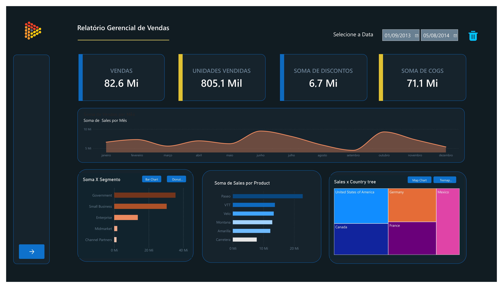

# Relatário-Gerencial-de-Vendas
Projeto Bootcamp para formação em Power Bi

## Que foi Aprendido

Durante as aulas, foi desenvolvido um relatório de vendas detalhado, focado em transformar dados brutos em insights estratégicos. O aprendizado envolveu a construção de gráficos dinâmicos e a implementação de indicadores (bookmarks), que permitem uma navegação intuitiva e interativa pelas métricas de negócio. Por fim, foi realizado o processo de governança e compartilhamento com a publicação do relatório no Power BI Service, garantindo que as informações fiquem acessíveis de forma segura na nuvem.

## Autores
Mentora das aulas
- [@julianazanelatto](https://github.com/julianazanelatto/power_bi_analyst )

## 🚀 About Me
Formada em Ciencia da Computação sempre estou buscando novidades na área de tecnologia.

